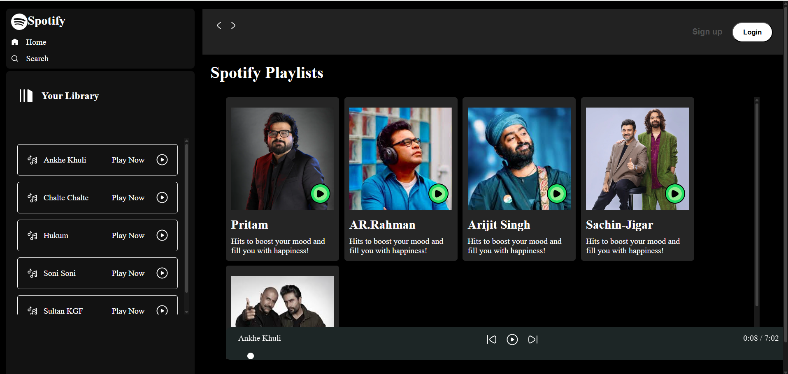

# Spotify Clone

As part of my journey in web development, I built a Spotify Clone using HTML, CSS, and JavaScript to demonstrate my front-end development skills. This project features a responsive and user-friendly interface that allows users to browse and play music seamlessly.The interface is designed with HTML and CSS, ensuring an intuitive and visually appealing layout, while JavaScript powers the core functionalities, including playback controls such as play, pause, next, and previous.This project also helped me gain hands-on experience with version control using Git and GitHub, reinforcing best practices in collaborative development and code management.

## Tech Stack
- **HTML5**
- **CSS3**
- **JavaScript**

## Features
- **Play/Pause**: Allows the user to start or pause the playback of the currently selected track.
- **Next/Previous**: Enables the user to skip to the next or previous track in the playlist or album.
- **Seek**: Allows the user to manually move forward or backward within a track by dragging a slider or clicking on a progress bar.
- **Display the currently playing song and album artwork.**

## Usage
Once the Spotify clone is open in your browser, you can click the play button next to the song to start playing it and use the playback controls at the bottom of the page to control the song playback. The currently playing song and album artwork are displayed in the "Now Playing" section at the bottom of the page.

## Screenshot

